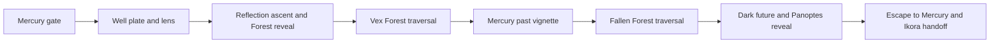

> Implementation update: the Lua/controller foundation and isolated tests are now saved. Production integration remains blocked pending approval. See [the implementation checkpoint](BEYOND-INFINITY-IMPLEMENTATION.md) for current status and remaining native work.

# Beyond Infinity reconstruction

Updated 8 September 2026. Target: the installed Dawn Lua/C++ architecture.

**Status: reference reconstruction and native catalog recovered; playable implementation unfinished.** No Beyond Infinity runtime adapter, executable mission Lua, launch preset, native receipt routing, or installable candidate has been added. The generated C++ catalog compiles and matches the installed packages. This is not evidence of a working mission. The existing DLL, three mission scripts, and launch settings remain the baseline.

## Evidence and scope

The requested scope is the complete mission, from arrival outside Mercury's Forest gate through the return to present-day Mercury and the Ikora handoff. The intended fidelity is the observed mission, supplemented by the supplied transcript where the recording omits dialogue. An exact reproduction of hidden conditions, off-camera combat, procedural choices, and retry behavior is not established by this recording.

Primary reference: [D3 GideoN, Beyond Infinity Mission Destiny 2](https://www.youtube.com/watch?v=wzwJ69pzSIE), uploaded 5 December 2017, reported duration 11:11. All 14 contact sheets, covering 335 samples at a two-second cadence across the full video, were inspected. The available automatic captions were also read through the ending, and four additional precise samples at 11:08, 11:09, 11:10, and 11:10.5 confirmed the final countdown and black ending. This was a full-timeline sampled review, **not continuous, frame-by-frame audiovisual playback**. Times below are approximate observations with about two seconds of uncertainty; they are not engine timer values.

The user's pasted transcript is preserved verbatim in `build/coo/beyond-infinity-research/user-transcript.txt`. The supplied [IGN walkthrough](https://www.ign.com/wikis/destiny-2/Beyond_Infinity) provides route context. Its pasted content was available; live retrieval of IGN failed. The [Destinypedia page](https://www.destinypedia.com/Beyond_Infinity) has no objective sequence. Objective text in this reconstruction comes directly from the installed game packages, cross-checked against visible HUD cards where present.

Important limits of this particular recording:

- It begins with the player already on Mercury. The opening Sagira/Ikora exchange in the supplied transcript is not established by the recorded first minute.
- Two other Guardians are visible. This is a fireteam recording; their actions can trigger progression or kill enemies outside the camera view.
- At approximately 06:34, a joining-allies countdown appears; approximately 06:40–06:44 is black. The player arrives in the past at about 06:46. Dialogue appears to restart across this transition. Preserve the loading/teleport observation rather than interpreting it as an authored pause.
- The party reaches the future ahead of the camera. Several lines in the supplied transcript are absent or skipped in the recorded future visit. Native rows establish that those lines exist, not that all were played in this run.
- The automatic captions contain transcription errors. Use the supplied transcript and native text for wording; use captions as approximate timing evidence.
- No player death, wipe, checkpoint retry, or completed return-to-orbit transition is shown. The last visible countdown reaches one second; precise samples at 11:10 and 11:10.5 are black. No next destination is visible.

## Recovered objectives

Native objective table: `80F46223`. Directive sensor: registry `03632571`, descriptor `80F46225`, type 68, slot 0. Eleven rows exist. Repeated wording is attached to distinct event hashes and must not be deduplicated by text.

1. `29BFCE5A` — **Enter the Infinite Forest**. Description: “Open the gateway with Sagira's assistance.” Visible at arrival, approximately 00:00–00:02.
2. `2FDA4350` — **Search for Osiris**. Description: “Activate the Well of Echoes.” Search objective appears around 00:30–00:36; the expanded description is readable around 01:02–01:08.
3. `B1AD777D` — **Search for Osiris**. Description: “Travel deeper into the Infinite Forest.” Expanded HUD visible around 02:08–02:10, after the lens breaks and the first Reflection appears.
4. `9225AEF3` — **Learn from the Reflections of Osiris**. Description: “Travel deeper into the Infinite Forest.” New objective card around 03:40; title readable around 03:42–03:46.
5. `D60FA7DF` — **Learn from the Reflections of Osiris**. Description: “Study Mercury's past.” The past visit is visible at approximately 06:46–07:16. The complete expanded description is package-confirmed, not readable in the sampled past footage.
6. `BE5F8E8B` — **Learn from the Reflections of Osiris**. Description: “Travel deeper into the Infinite Forest.” A separate package event associated with the transition back toward the Forest; exact publication boundary remains unverified.
7. `142EC956` — **Learn from the Reflections of Osiris**. Description: “Travel deeper into the Infinite Forest.” Another separate package event. The second Forest traversal is visible from approximately 07:32. The video alone cannot distinguish this event from row 6 by text.
8. `64B46F54` — **Learn from the Reflections of Osiris**. Description: “Observe the dark future.” The future is visible from approximately 09:58. Expanded HUD publication was not verified in the samples.
9. `5569523A` — **Escape to reality**. Description: “Escape Panoptes, the Infinite Mind.” Panoptes appears around 10:10–10:12; the player retreats around 10:18–10:24. Exact objective publication is not visible in the samples.
10. `5AD156F5` — **Escape to reality**. Description: “Escape Panoptes, the Infinite Mind.” A second native event with the same text. The return corridor spans approximately 10:26–10:44. Which exact boundary selects this event still needs native verification.
11. `E2AC714F` — **Tell Ikora the news**. Description: “Rendezvous with Ikora at the Tower.” Package-confirmed. At about 11:00–11:02 the recording shows mission completion, a milestone update, and a prompt to speak to Ikora Rey. Do not treat that milestone text as direct proof this directive event was published.

This is the native table order. Video correspondence is explicitly stated above; table order alone does not recover all runtime transitions.

## Mission sequence to implement



### 1. Mercury entrance, 00:00–00:30

Arrival is immediately outside the triangular Infinite Forest entrance in The Lighthouse. The party walks up the stairs, crosses the gateway around 00:14, and runs through the triangular corridor. The Vestibule location appears near 00:30 and the objective changes to finding Osiris.

The supplied opening exchange establishes Sagira's determination to find Osiris and Ikora's warning about navigating the Forest. Native dialogue row 0 contains this opening exchange. Do not replace it with a new recording or emit every constituent string as a separate simultaneous cue. The run begins too late to establish its launch-relative timing.

Implement the proper activity contract before world arrival. The Lua stage should select the entry objective and the intended opening dialogue; the native adapter should create/enable the verified gate objects and report actual arrival and crossing. Entering a volume is traversal evidence, not a scene completion receipt.

### 2. Vestibule and Well of Echoes, 00:30–02:20

The party crosses disconnected platforms and enters the cylindrical Well. At about 01:02 the camera can see the suspended, shielded lens/cube and its beams. The player fires at it before reaching the plate; this does not establish puzzle completion. The camera then follows the left-side ascending route.

At approximately 01:48–01:50 the player stands on the plate; the ring lights up. Shots around 01:54–01:58 break the central object. The vertical beam is established around 02:00, a Reflection appears near 02:06, and the expanded objective changes to travelling deeper around 02:08. A path begins forming around 02:16–02:20.

Sagira explains the Reflections while the player climbs. The first Reflection greets Sagira, reacts to the Guardian's connection to Ikora, and begins the sequence of copies carrying word of her return.

Required gate: native plate activation/exposure, followed by genuine destruction of the same lens object. Merely entering the plate volume, elapsed time, shots fired, or reaching the upper path must not stand in for destruction. The exact device positions and destruction callback association have not been verified. The presence of dormant Vex sources in the package does not justify requiring all of them to die.

### 3. Reflection ascent and Forest reveal, 02:20–03:44

The player follows the new curved platforms upward. Reflections split, run, vanish, and speak along the route. The supplied dialogue includes Sagira being told her presence is dangerous, the creation of more Reflections, the warning that it is nearly too late, and the question of where the real Osiris is.

The party emerges at the Infinite Forest around 03:14–03:18. The Reflection's description of the Forest starts around 03:24. The party waits while the vista is revealed; the route generates near 03:40, followed by the Learn objective.

Use the authored cast and scene assets. Schedule them in small sections as their approach conditions are met; do not activate the entire Reflection gallery at arrival. Capture scene binding, start, relevant signal, and completion as separate facts. Audio owned by a native scene must not also be queued through the host dialogue service.

### 4. First Forest traversal, 03:44–06:38

The first traversal uses Vex encounters. The camera passes combat pockets, connecting platforms, circular structures, stairs, and doorways. Sagira explains that simulated enemies can kill the Guardian around 03:44–03:54. The Daemon/door tutorial is visible and captioned around 04:22–04:30.

Observed combat intervals are approximately 03:50–04:28, 04:36–05:10, and 05:26–06:12, with travel between them. These are observation windows, **not recovered encounter cohorts or exhaustive kill counts**. Some enemies remain alive behind or beside the player. Ally activity is not fully visible.

Blocked doors depend on the relevant local Daemon. Preserve the distinction between that gate's mandatory enemy and optional enemies. The recording does not establish that clearing every actor on each generated platform is necessary. Keep native procedural population ownership if that generator supplies it; do not layer a second manually spawned population over it.

The party reaches the past portal approach around 06:12–06:22 and traverses the corridor through 06:38. Joining allies then interrupts the camera's continuous travel. The native generator seed, segment IDs, population variants, per-door Daemon ownership, and regeneration receipts are still unresolved.

### 5. Mercury past vignette, 06:38–07:32

After the joining-allies interval, the camera sees the golden grass, trees, bright sky, and distant Vex construction of Simulant Past. Reflections explain Mercury before the Vex and the seed that became the Infinite Forest and Panoptes. Vex structures materialize in the landscape while the player moves through the vignette.

The small return portal is visible by 07:12–07:14; the player crosses at approximately 07:16 and moves through another corridor. The second Infinite Forest entrance is reached near 07:32.

The supplied transcript and native bank establish longer explanations of Panoptes' purpose. In this recording, some speech overlaps travel and the arrival description repeats across the joining-allies transition. Preserve those as run observations, not a reason to hardcode a duplicate line into every solo attempt.

Implement the authored Reflection scene, machines, rumble, and return teleporter with actual native ownership. Native scene events should own visual construction timing; no guessed delay should masquerade as acknowledgement that a machine or portal exists.

### 6. Second Forest traversal, 07:32–09:58

The second traversal features Fallen. The camera shows Shanks and other Fallen combatants; a Heavy Shank label is readable near 09:04. Segments and gateways form while the party moves. Several red blocked-door effects are visible before subsequent advances.

Observed combat/travel windows include approximately 07:38–08:04, 08:08–08:42, and 08:46–09:28. These are not a verified segment count. The player crosses the next exit approach around 09:30–09:38, enters the corridor, and approaches the future gateway through 09:56.

The dialogue covers failed attempts to change the outcome, the awakened Traveler, Osiris' prophecies, and the future the Vex want. Distinct objectives with identical text must retain their own native event identities. The second route must use a new generator incarnation and the intended Fallen selection, without accepting readiness, deaths, or door acknowledgements from the earlier Vex traversal.

### 7. Dark future and Panoptes, 09:58–10:24

The party stands with a Reflection at the ruined Lighthouse in the dark future. The supplied transcript describes the absence of Light, Darkness, the sun's warmth, and life. It then identifies the Guardian as the possibility of avoiding that future. The recording arrives after some of these lines would normally play; do not invent timestamps for them.

Panoptes manifests around 10:10–10:12. The player shoots at it, but this is a reveal and escape encounter. The Reflection urges the Guardian to leave. Hostile activity and deletion/teleport effects accompany the retreat toward the escape route around 10:18–10:24.

The transcript reports a restricted-respawn area and a large ambush. The package contains separate front/back ambush sources and an after-wipe Reflection scene. Exact spawn counts, restriction boundaries, and retry selection still need live verification. Do not import Omega's damage phases, Arc-charge mechanics, or a Panoptes-death completion gate.

### 8. Escape, completion, and handoff, 10:24–11:11

The player returns through a triangular corridor around 10:26–10:44. The Lighthouse location reappears near 10:38; the party emerges into present-day Mercury around 10:46, with an objective-complete toast.

The recording includes Sagira's warning that everyone must work together during the return corridor. This is native dialogue row 47 and is absent from the supplied pasted transcript. Around 10:46, the final radio exchange with Ikora begins. The mission-complete banner appears around 11:00, with the milestone to speak to Ikora Rey and an end countdown. The player remains on Mercury during the visible countdown.

Completion must require authenticated escape/return plus the acknowledged ending dialogue window. The narrator saying they will return to the City is not evidence that the game has already loaded the Tower. Do not start Deep Storage or claim the Tower conversation happened. Capture the final native completion publication and the subsequent destination before implementing the handoff.

## Native package map

Confirmed named activity: `adventure_vod`, activity asset `80F46000`, scenario `80F46015`, root registry/package hash `03632571`. The activity asset directly contains the scenario and launch descriptor `80F9FDD2`. `mission_bond` is A Garden World and is not the correct mission.

Activity 294 / investment hash `3E9433BD` is a **launch candidate**: the public activity table row at `0x1300` resolves to definition `0x4AD88`; a nearby package record pairs the mission root with a 294 field. The complete structural join and live prelaunch contract have not been validated. Do not add a production preset based only on that candidate.

Scenario-owned section regions recovered from registry membership:

- Present Lighthouse: bubble 15, region 120; local registry `DA02FEF1`.
- Vestibule/Well: bubble 19, region 152; puzzle registry `233E7149`, Reflection registry `1194F70F`.
- Infinite Forest A: bubble 8, region 64; generator registry `8E70632B`.
- Past vignette: bubble 18, region 144; registry `C7FB7155`.
- Future vignette: bubble 4, region 32; Reflection/Panoptes registry `15FFBE16`, ambush registry `0FF26BCC`.

Opening spawn candidate `26B11B02` has three points around `(269, 250, 87)` in native map tag `80F50039`, spatially matching the named opening dialogue filter. This is a package-based candidate, not a live accepted spawn. The Gateway opening spawn `69F52B3E` belongs to a different landing area.

Useful verified descriptors, in registry / type / slot order:

- Dialogue sensor: `03632571 / 53 / 2`, descriptor `80F4622B`, bank `80F1FDF7`, 49 rows. Rows include compound and potentially scene-owned speech; ownership must be resolved before host dispatch.
- Well plate object: `233E7149 / 4 / 34`, `80F462AD`.
- Well plate player monitor: `233E7149 / 30 / 73`, `80F46320`. Its native plate volume is type 60, slot 119. A sampled position within this volume does not prove plate charge completion.
- Lens object: `233E7149 / 4 / 36`, `80F462B3`; lens device: `233E7149 / 23 / 41`, `80F462C2`.
- Plate-to-lens device: `233E7149 / 23 / 38`, `80F462B9`; lens-to-core device: `233E7149 / 23 / 40`, `80F462BF`.
- Well beam/rings/exit/lighting: registry `233E7149`, type 23, slots 29–33, descriptors `80F4629E`, `80F462A1`, `80F462A4`, `80F462A7`, `80F462AA`.
- First Reflection scene: `1194F70F / 43 / 14`, `80F46367`; first cast source: `1194F70F / 1 / 0`, `80F46331`.
- Forest reveal scene: `338D8E1D / 43 / 0`, `80F46110`; associated source: `338D8E1D / 1 / 1`, `80F46114`.
- Forest map-generator sensor: `8E70632B / 37 / 3`, `80F460FA`. Its existence does not identify a generation request's values or completion receipt.
- Well/future doors: `8E70632B / 23 / 1` and `/ 23 / 0`, `80F460F4` and `80F460F1`.
- Past Reflection scene: `C7FB7155 / 43 / 6`, `80F461D1`; past source: `C7FB7155 / 1 / 4`, `80F461CC`.
- Past teleporter device: `C7FB7155 / 23 / 3`, `80F461C7`. Construction devices occupy type 23, slots 14–17; decorative objects and rumble are separate.
- Future scene: `15FFBE16 / 43 / 0`, `80F4608D`; after-wipe scene: `/ 43 / 1`, `80F46090`.
- Future Reflection sources: `15FFBE16 / 1 / 2` and `/ 1 / 4`, `80F46093` and `80F4609A`.
- Panoptes source: `15FFBE16 / 1 / 6`, `80F460A0`; its spawn rule is `/ 66 / 21`, `80F4607E`.
- Future ambush: `0FF26BCC / 1 / 6` through `/ 1 / 14`. Those nine source definitions are not nine verified actors or a recovered simultaneous spawn count.

The full extraction has 23 roster groups, 365 roster slots, 73 static source definitions, 87 parsed volumes, 49 dialogue rows, and 11 objective records. Generated Forest populations are not enumerated by the static-source total. The typed catalog is `src/state/activity/beyond_infinity/catalog.h`; detailed source categories, alternative selections, rule references, regions, and raw tag hashes are in the evidence JSON.

## Runtime implementation still required

1. Complete the activity-table/spawn join and a native launch smoke test. Preserve the existing mission adapters and selection behavior.
2. Verify plate charging, lens immunity/exposure/destruction, and beam/ring/exit device values. Route the genuine owner-scoped destruction into the shared destructible service.
3. Recover the Reflection scene cast bindings, event IDs, native acknowledgement boundaries, and dialogue ownership. Keep scene timing with its acknowledged owner.
4. Recover Forest A's generation inputs, seed/segment recipe, local Daemon ownership, Vex/Fallen selection, and clean second-generation transition. Omega's one-traversal mission filter and Vex-only switch do not satisfy this mission.
5. Implement the past vignette devices and return portal using their own scene/controller receipts.
6. Implement the future reveal, controlled ambush, escape teleport, after-wipe branch, and present-Mercury return. Do not fabricate deaths or scene completion to move past an unsupported interaction.
7. Author the eight sections in a real `beyond_infinity.lua` only against the resulting supported native capabilities. Keep dependency choices and completion gates in Lua. Preserve early valid observations and reject stale generations on each repeated traversal or retry.
8. Register runtime selection, roster/authority publication, hooks, project items, and a mission regression suite. Then extend `verify_lua.py`, `package_lua.py`, and `install_candidate.ps1` together for the fourth shipped script and matching rollback payload. This offline catalog is deliberately not registered as a playable fourth mission.
9. Run full Debug/Release regressions and DLL builds, package the frozen candidate, install only with Destiny closed, and record an uninterrupted live playthrough plus retry evidence. Compare the live log's script fingerprint and installed DLL hash with that exact candidate.

## Validation and artifacts

Run from `C:/Destiny 2 Development`:

```powershell
python tools/coo/recover_beyond_infinity.py --check
python tools/coo/generate_beyond_infinity_catalog.py --check
python tools/coo/verify_beyond_infinity.py
```

These checks passed: fresh extraction equals saved evidence; generated C++ equals the extraction; wrong scenario, objective, and opening dialogue are rejected; catalog compiles and passes identity/geometry checks in both Debug and Release with warnings treated as errors. Results are in `build/coo/beyond-infinity-research/validation/results.json`. These checks exercise no live game behavior and do not replace the full mission/DLL suite.

Evidence directory: `C:/Destiny 2 Development/build/coo/beyond-infinity-research/`.

- `baseline.json`: source commit, pre-existing changes, executable/DLL/PDB/script/cache hashes, and no-live-acceptance status.
- `reference.mp4`, `reference.en.vtt`, `caption-review.txt`, `user-transcript.txt`: preserved reference material and caption review.
- `reference-provenance.json`: URL, channel/date/duration, media hashes, sampling method, and coverage limitations.
- `contact-01.jpg` through `contact-14.jpg`, `frames-2s/`: full-timeline visual samples. Sheet labels are approximate sampling times, not exact event timecodes.
- `native-bindings.json`: reproducible native facts, with no fabricated gameplay receipts.
- `native-tags/manifest.json` and associated blobs: narrow raw evidence for the activity, scenario, objective/dialogue, generator, and central scene/puzzle descriptors.
- `validation/`: isolated Debug/Release catalog executables, build logs, test logs, and results.

There are **no supported Beyond Infinity launch instructions yet** because a playable adapter and accepted launch contract do not exist. Selecting a look-alike level or publishing only the objective list would not constitute the requested 1:1 mission reconstruction.
