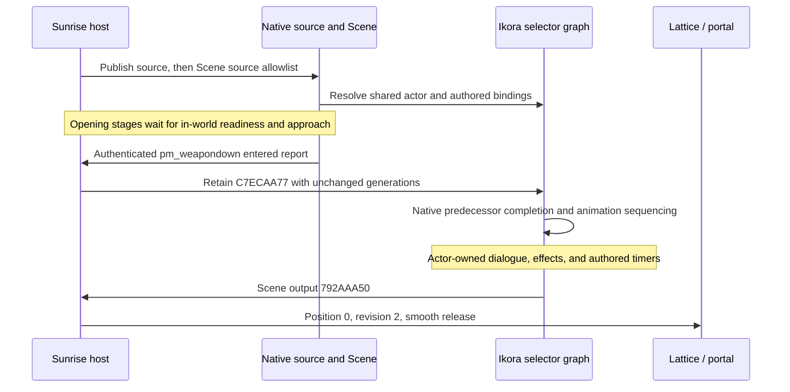
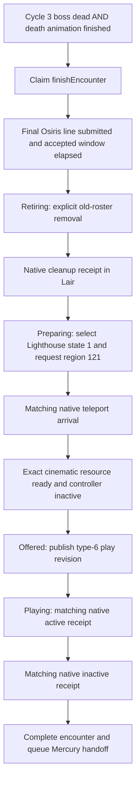

# Ikora animation synchronization and the mission-ending cutscene

Implementation guide for Omega / `mission_scot`, checked against the local source on **6 September 2026**.

Ikora's sequence works by giving the native Scene graph a correctly authorized source actor, then allowing its animation wrappers, dialogue, and effects to follow the authored graph. The mission ending follows the same principle at a larger scale: Sunrise supplies the progression and transition commands, while the native cinematic owns its cast, cameras, animation, and dialogue.

This guide covers how those systems fit together, which fixes made them work, and the complete path from Panoptes' final death to the Lighthouse cutscene and subsequent Mercury return.

## 1. Which implementation this guide describes

The current project uses the September 6 archive integration. Its active ending implementation is `state/activity/omega_ending.cpp` with `omega_ending_rules.h`, and its native cinematic observer is `client/hooks/bootflow/omega_lair_cinematic.cpp`. The similarly named files under `state/activity/omega/`, including `omega_ending_runtime.h`, belong to the earlier implementation; the old `omega_reveal_native.cpp` is outside the current DLL project.

For Omega, `Snapshot::archiveOmega` selects the current authority encoder. The `*_other_missions.cpp` files preserve the separate compatibility path. This distinction matters when following a function name or choosing a test: a file can remain in the workspace without owning the current mission.

Source: [archive integration notes](<C:/Destiny 2 Development/Sunrise/OMEGA-SRC-PORT.md>), [DLL project](<C:/Destiny 2 Development/Sunrise/Sunrise.vcxproj>).

In this document, **authority** means the host's desired state, **sense** means the client's reported state, and a **native receipt** means an observation made at the relevant native operation. Sending a command is distinct from observing its completion. A **generation** or **revision** lets the receiver distinguish a new operation from a retry.

## 2. How the Ikora actor works

### One source actor, several authored animation wrappers

The important runtime identities are:

- `D00142CF/1/0`: Ikora's source, using authority schema `80807EC9`.
- `D00142CF/43/1`: the opening Scene controller, using authority schema `8080626B`.
- `80EC0F95`: the authored selector graph that coordinates the sequence.
- `80EC0F27`: the Ikora entity definition.
- `D00142CF/23/16`: the nearby portal lattice's device controller.

The slash notation is `registry key / object type / slot index`; these are native object identities, not asset paths.

The source's 641-bit authority requests one actor with source generation 1 and **Scene-request mode 1**. This mode leaves the population request under the Scene's control. Canonical absent references select the source's existing inline authored placement; the packaged actor selectors remain at their defaults. The implementation does not need an independently positioned Ikora to stand in for that source.

The Scene's initial 129-bit authority supplies:

- Stable raw wire generation `80EC0F96`.
- `stop = false`.
- One allowed source: `D00142CF/1/0`.
- Source-list revision 1.
- An initially empty external-event list.

The encoder publishes the source before the Scene in the Scene/Ready stages, even if extraction returns the descriptors in a different order. It rejects missing or duplicate required source/Scene entries before emitting the final packet.

Source: [source body](<C:/Destiny 2 Development/Sunrise/src/middleware/bap/activity_message/activity_sensor_auth_bodies.cpp:600>), [Scene body](<C:/Destiny 2 Development/Sunrise/src/middleware/bap/activity_message/activity_sensor_auth_bodies.cpp:537>), [ordered publication](<C:/Destiny 2 Development/Sunrise/src/middleware/bap/activity_message/activity_sensor_auth_encoder.cpp:375>).

### Why the earlier versions produced duplicates and mismatched effects

The earlier Scene authority lacked the source allowlist, and the source did not have the required requested population. Native selector parameter **5630** could not resolve the shared actor. Subsequent animation wrappers could then create fallback bodies instead of adopting that actor.

That explained why an apparently correct animation could coexist with an extra static Ikora or effects associated with another actor. Historical experiments isolated three child Scenes: `80EC0F0E`, `80EC0FA8`, and `80EC0FA6`. In particular, `80EC0FA8` carried the wanted Void effects, so deleting that entire Scene also removed useful events. Hiding its render models addressed the extra body but did not restore the missing actor binding.

The ownership fix supplied the native source and its Scene allowlist. The imported development record reports parameter 5630 resolving the same actor for the source animation and child `80EC0F80`, followed by user confirmation of the orb/prelude. This is the core of the synchronization fix: the wrappers can share the intended actor and its native animation state.

Historical evidence: [Ikora source and sequence findings](<C:/Users/gauta/Downloads/docs/docs/OMEGA-IKORA.md>), [source contract and native instruction verification](<C:/Users/gauta/Downloads/docs/docs/omega/reference/IKORA-SOURCE.md>).

## 3. How the animations, dialogue, and portal stay synchronized

### Start only after the world and actor machinery are ready

Opening publication requires the native mission authority runtime to be initialized, the exact Omega roster to be ready, the world phase to be `arrived`, and the mission seed to be armed. The later authenticated approach edge releases the opening stages.

This preserves the intended arrival → Ghost preroll → approach → Ikora sequence. A roster acknowledgement can arrive during loading; it is not proof that the player can see the world. Earlier publication spent the opening's available time behind the loading screen and skipped the natural preroll/dwell.

Source: [opening readiness and stage progression](<C:/Destiny 2 Development/Sunrise/src/server/bap/encrypted/push/activity/activity_roster_snapshot.cpp:786>).

### Advance the waiting orb with one retained event

The selected trigger is the authenticated `pm_weapondown` monitor, **type 30 / slot 20**, linked to authored volume **60/29**. It latches `omegaOpeningTriggered`, which produces `omegaIkoraPortalRequested` while Omega Scene authority is active.

The Scene then retains external event **`C7ECAA77`**, increasing its body from 129 to 161 bits. The source, source generation, Scene generation, and source-list revision stay unchanged.

The original native event handler, `B41330`, compares the incoming list against committed event history. A newly present C7 is delivered once. Retrying the same authority, sending a keepalive, or walking away and back does not repeatedly fire it. Removing and reinserting the event, or changing generations on every publication, would defeat this design.

The graph combines this event with its native predecessor-completion conditions to advance the orb into the portal-opening wrappers. Sunrise supplies the missing external input; the native graph owns the internal animation sequencing and authored delays.

The monitor-to-C7 connection is **reconstructed host policy**. It is distinct from `pt_start_ikora_vignette` at **31/18**, linked to volume **60/28**. The original retail host connection and its precise dialogue prerequisites have not been recovered. Direct Forest/Lair starts without the accepted opening edge do not synthesize C7.

Source: [approach latch and Scene output routing](<C:/Destiny 2 Development/Sunrise/src/server/bap/encrypted/activity_message/activity_message_route.cpp:654>), [snapshot policy](<C:/Destiny 2 Development/Sunrise/src/server/bap/encrypted/push/activity/activity_roster_snapshot.cpp:485>), [C7 verification](<C:/Users/gauta/Downloads/docs/docs/omega/reference/IKORA-C7.md>).

### Leave actor-owned dialogue with the actor

Dialogue bank `80F1FD07` marks rows **1, 3, and 4** as Ikora actor-owned. Their timing belongs to the actor graphs. The host presentation queue handles its own gameplay/Ghost cues and avoids duplicating those lines.

This keeps actor dialogue tied to native animation events rather than placing a second copy on an independent host schedule. Source: [dialogue ownership and durations](<C:/Destiny 2 Development/Sunrise/src/state/activity/omega_presentation_rules.h:27>).

### Release the lattice on the graph's output

The gate starts at **position 1, revision 1, snap enabled**: its locked presentation. Power remains 1 and lock remains 0, both with revision -1, so those channels are not newly commanded.

The native graph's authored 12.5-second timer produces output **`792AAA50`**. Sunrise receives that output through the exact Scene sense slot `D00142CF/43/1`, validates the binding, generation, full body, and fresh revision, then latches the release. The ordinary authority publisher sends **position 0, revision 2, snap disabled**, allowing the native device presentation to dissolve smoothly.

The host does not start its own 12.5-second timer. It waits for the graph output, which preserves the connection to the actual running Scene. The graph's other events, including `5598C86B` and orb-child retirement `E0651437`, are not substitutes for the lattice release.

The retained release also enables the native portal entry carrier. The nearby lattice is the locked state of this device, rather than a separately spawned wall panel.

Source: [lattice parser and persistent state](<C:/Destiny 2 Development/Sunrise/src/state/activity/omega_ikora_lattice.h>), [gate body](<C:/Destiny 2 Development/Sunrise/src/middleware/bap/activity_message/activity_sensor_auth_bodies.cpp:119>), [authored graph and device evidence](<C:/Users/gauta/Downloads/docs/docs/omega/reference/IKORA-LATTICE.md>).

### Packet framing was part of the fix

Correct animation authority bytes still fail if the surrounding object packet is malformed. The source, Scene, gate, and portal carrier descriptors have both authority and sense flags (`03`). Their packet envelopes therefore include an **absent-sense bit**, even when no sense body is sent in that direction.

An earlier ordered writer retained only the authority flag. Native decoding then consumed beyond the advertised object boundary, preventing the Scene from reliably requesting the actor. The fix preserved the descriptor flags and added the authority bit without discarding sense. The current ordered writer follows this rule.

The source's 641-bit body consequently occupies 644 payload bits with this framing; the Scene occupies 132 or 164. Tests must check those object boundaries as well as the raw body bytes. See the [framing regression and fix](<C:/Destiny 2 Development/build/omega-ikora-fix-20260905/ikora-framing-fix.md>).

### Current local configuration caveat

The successful native-source investigation used `ikora_carrier_model_suppression=false`. The current local [settings file](<C:/Destiny 2 Development/Sunrise/settings.json:25>) has that historical option set to **true**, and the active probe still contains the narrowly scoped render-model suppression path. That means this checkout should not be described as having removed the experiment entirely.

Also, despite its name, `ikora_vfx_rebind` currently enables an **observation-only** root-delta calculation. It logs that a root-position delta is not an attachment rebind; it does not move the beam. Shared native ownership is the synchronization mechanism. Beam attachment needs its own visual confirmation.

Source: [effect observation](<C:/Destiny 2 Development/Sunrise/src/client/hooks/bootflow/omega_ikora_origin_probe.cpp:681>), [legacy model suppression](<C:/Destiny 2 Development/Sunrise/src/client/hooks/bootflow/omega_ikora_origin_probe.cpp:778>).

## 4. The final cutscene is a native cinematic

The ending uses the Lighthouse's authored bookend variant:

- Scenario bubble **15**, state **1**, packed runtime region **121**.
- Bookend registry **`3A6CE17A`**, registry tag **`80F47BCE`**.
- Generic cinematic controller **`80F47BCB`**, **type 6 / slot 0**.
- Full cinematic entity **`80C177DE`**.
- Cinematic resource **`80C177DD`**, looked up by selector **`2FECC6FD`**.
- Host transit target spawn set **`AB06CC27`**.

This movie owns Osiris, Ikora, Sagira, the Guardian, cameras, animation, and its internal dialogue. Sunrise activates its native controller. The short Lair intro is a separate controller/resource, so its completion cannot satisfy the ending.

The ending controller uses schema `80804F08`, with a 263-bit body for its empty native collections. Its descriptor is **authority-only, flags 2**; it does not advertise an invented sense schema. The current writer starts with two zero 64-bit fields, then sends the ending revision and play flag with the remaining native reference/default fields.

Source: [ending identities and state machine](<C:/Destiny 2 Development/Sunrise/src/state/activity/omega_ending_rules.h>), [current cinematic authority body](<C:/Destiny 2 Development/Sunrise/src/middleware/bap/activity_message/activity_sensor_auth_bodies.cpp:657>).

## 5. Mission end → cutscene, step by step

### Step 1: Confirm the final death and its animation

The encounter must be in the third Crown cycle's death stage and receive both the qualified native **boss-dead** milestone and **death-animation-finished** milestone. `finish_death()` schedules `Action::finishEncounter` only when both are present; they can arrive in either order.

The ending request carries the encounter identity: run, action epoch, boss actor, and generation. The ending bridge checks it against the current encounter and claims the action once. Actor disappearance, a removed source, or an elapsed fight duration cannot trigger this boundary.

Source: [death completion gate](<C:/Destiny 2 Development/Sunrise/src/state/activity/omega_first_lair_encounter.h:626>), [request validation and action claim](<C:/Destiny 2 Development/Sunrise/src/state/activity/omega_ending.cpp:166>).

### Step 2: Let Osiris's final gameplay line finish its accepted window

The presentation system requests bank row **33**, selector **`921B35F9`**, the final Osiris gameplay/Ghost line. It waits for the exact row generation to be submitted, then respects the native **5,000 ms delay + 3,852 ms duration + 250 ms margin = 9,102 ms**.

`ending_dialogue_finished()` also requires the defeat state and no active pending dialogue row. A missing submission cannot become success just because enough time passed. Submission is evidence that the native audio request was accepted, rather than proof that sound was audible on the user's device.

Source: [dialogue completion predicate](<C:/Destiny 2 Development/Sunrise/src/state/activity/omega_presentation_rules.h:126>), [submission handling](<C:/Destiny 2 Development/Sunrise/src/state/activity/omega_presentation_rules.h:361>).

### Step 3: Retire the Lair before changing regions

The ending moves from `dialogue` to **`retiring`**. Its terminal roster preserves the old bubble/key order but publishes the old keys with **zero presence**, then appends the bookend registry to bubble 15. Only the retained global services and bookend receive the terminal object bodies.

This detail matters because the native roster consumer compares presence at matching ordinals and walks the incoming count. Simply omitting the old keys is not equivalent to asking it to remove them.

The native roster-apply observer checks the exact seven-group Lair removal while still in bubble 14. It calls the original cleanup once, then verifies that the applied mirror contains the removal and all seven old group descriptors are absent under the same owner. Only this receipt advances the ending into **`preparing`** and releases the state-121 request. A sent packet or roster acknowledgement is insufficient.

This keeps scene teardown ahead of world transition, instead of applying authority into objects the old slice is freeing.

Source: [terminal roster construction](<C:/Destiny 2 Development/Sunrise/src/server/bap/encrypted/push/activity/omega_lair_roster.h:292>), [native cleanup observer](<C:/Destiny 2 Development/Sunrise/src/client/hooks/bootflow/omega_dialogue_dispatch_probe.cpp:2148>), [before/after cleanup checks](<C:/Destiny 2 Development/Sunrise/src/client/hooks/bootflow/omega_teardown_native.h:173>).

### Step 4: Request actual native travel to the bookend

After cleanup, global state selects the ending Lighthouse variant. Changing an initial-slice advertisement alone cannot move a player already in a valid Lair world. The implementation therefore projects a **host teleport command in activity message 12**, using the copied native **message 22** report as its input.

The host transaction is:

1. From an idle local tuple, choose its previous command token plus one, skipping zero. Publish **host state 1**, region **121**, spawn set **`AB06CC27`**.
2. Wait for **local state 3**, the same command token/region/spawn hash, and actual current region **121**. This produces the arrival receipt and changes the host to **state 3**.
3. Wait for the matching local tuple to return to **state 0**, then retain **host state 0**. Keeping host state 1 would restart the command after the client became idle again.

The native client performs its pending-world transition through `C72CE0 → E2E790 → E1D400 → E25A30 → E2B120`, which selects transition type 7. The outgoing projection does not overwrite the stored client report.

The **teleport command token** and the client's **world-transition token** are separate. Membership continues to echo the native transition token. Host synchronization is acknowledged only when the native synchronization token, target-host readiness, region, and teleport tuple agree.

The spawn set is verified authored Lighthouse data. Choosing it for this ending is reconstructed policy; its retail semantic name and original host caller remain unresolved. Player coordinates and facing are supplied through native placement.

Source: [teleport transaction and synchronization predicate](<C:/Destiny 2 Development/Sunrise/src/state/activity/omega_ending_transit_rules.h>), [activity/member binding](<C:/Destiny 2 Development/Sunrise/src/state/activity/omega_ending.cpp:311>), [membership projection](<C:/Destiny 2 Development/Sunrise/src/server/bap/encrypted/push/activity/activity_membership_push.cpp:70>).

### Step 5: Wait for the exact cinematic resource and offer playback

World arrival and cinematic availability are distinct checkpoints. The native resource hook observes registration of `80C177DD` and records its world owner. The ending-controller observer checks that selector `2FECC6FD` resolves to that owner.

Only after arrival, resource readiness, and an inactive ending controller does `Ending::observe()` enter **`offered`**, allocate a new play revision, and set `play = true`.

The publisher keeps the streamed bookend group available. During the narrow `bookendState && arrived && play && !started && !failed` window, it also seeds the returning runtime's defaults. That seed replaces the ordinary runtime object list and stops once playback starts, protecting native runtime ownership.

Source: [native controller observation](<C:/Destiny 2 Development/Sunrise/src/client/hooks/bootflow/omega_lair_cinematic.cpp:1695>), [resource registration](<C:/Destiny 2 Development/Sunrise/src/client/hooks/bootflow/omega_lair_cinematic.cpp:1767>), [runtime seed predicate](<C:/Destiny 2 Development/Sunrise/src/middleware/bap/activity_message/sensor_auth_update.h:18>), [seed writer](<C:/Destiny 2 Development/Sunrise/src/middleware/bap/activity_message/activity_sensor_auth_encoder.cpp:337>).

### Step 6: Let native playback report start and finish

The hooks observe the ending component after its native apply/tick. They read its applied revision at **`+0x190`** and active flag at **`+0x260`**.

An active receipt at the offered revision, with the resource ready, enters **`playing`**. The bridge notifies the encounter that its ending has started and gives presentation ownership to the cinematic.

A later inactive receipt at the current revision, while the resource remains registered, enters **`complete`**, publishes stop authority with a newer revision, marks the encounter finished, and creates a pending return-handoff request. Resource unloading alone cannot complete the movie.

The approximately 168-second movie duration is descriptive. Completion uses the native active-to-inactive transition. Preparation has a 120-second failure bound and playback a 300-second bound. Unaccepted play offers have a one-second retry interval and at most three attempts; these limits fail the operation rather than manufacture completion.

Source: [playback state machine](<C:/Destiny 2 Development/Sunrise/src/state/activity/omega_ending_rules.h:148>), [start/finish forwarding](<C:/Destiny 2 Development/Sunrise/src/state/activity/omega_ending.cpp:264>).

## 6. Skip and post-cutscene return

### Skip still goes through native completion

The client's `cinematic_skip` incident is row **3338** in activity message 19. During playback, the host answers by publishing `play = false` with a new revision. The ending stays `playing` until the native inactive receipt arrives at that revision. Normal finish and skip therefore share the same completion path.

The related started/finished incident rows are 5239 and 1685, but they do not replace the controller's revision-qualified completion check. Source: [incident identities and skip behavior](<C:/Destiny 2 Development/Sunrise/src/state/activity/omega_ending_rules.h>).

### Return to Mercury is a second transition

The in-mission trip to the Lighthouse loads the bookend. After the movie completes, a separate frame-owned path requests **`mercury_freeroam`, activity 29**.

`omega_activity_handoff::poll()` waits for native session/member readiness, validates the destination, constructs the native selection, applies the recorded landing pair `A83A9175 / D49C610E`, and carries the existing fireteam transition nonce when available. It claims the handoff once and suspends the completed run's forced Omega selection before invoking native clear/select/commit wrappers.

Selection alone does not leave bootflow's `activity:in_world` step 38. Once the request is reflected—or its eight-second exit wait expires—the code deliberately requests cleanup step **28**, reason **309**. It maintains the **no_ship** transition classification, with the destination fields needed by the native loading path.

A scoped loading-cinematic suppression window supplies the common black/spinner transition and skips the orbit/flight presentation. This window is armed after the bookend has completed. It ends when bootflow leaves and returns to `in_world`, or after its 120-second bound. The no-ship correction has a separate 45-second bound.

This is an explicit native integration step: the code adjusts the fireteam's effective transition descriptor and detours the loading-cinematic suppression query. A `native_launch result=queued` log proves that the request was queued, rather than proving Mercury arrival.

Source: [complete return-handoff implementation](<C:/Destiny 2 Development/Sunrise/src/client/hooks/bootflow/omega_activity_handoff.inl>), [frame owner and loading suppression hook](<C:/Destiny 2 Development/Sunrise/src/client/hooks/bootflow/world_step.cpp>).

The Insert-menu ending preview is useful for testing the transit/movie/return path from the opening Lighthouse. It intentionally bypasses combat and Lair retirement because those actors have not been admitted. A successful preview is therefore not a full mission-end test.

## 7. Troubleshooting by the last completed checkpoint

- **Ikora never appears:** check roster readiness, source-before-Scene publication, descriptor framing, and native actor resolution. The September 6 local startup failure came from a missing Forest generator group: fixed index-range lookup missed registry `2763EC97` at catalog index 1197. Restoring lookup by key repaired the roster contract without weakening readiness checks. See [the local port/fix record](<C:/Destiny 2 Development/Sunrise/OMEGA-SRC-PORT.md>).
- **Ikora holds the orb indefinitely:** check whether `pm_weapondown` was accepted and C7 appears in the Scene event list. Then inspect native predecessor completion and actor bindings. Relevant logs include `omega_ikora_selector` and `omega_ikora_origin`.
- **The animation restarts on approach or keepalive:** check for generation changes or C7 being removed and reinserted. Ordinary backtracking should preserve the accepted latch.
- **The lattice stays closed:** look for `ev=omega_lattice stage=host_release`, event `792AAA50`, then position revision 2. C7 submission by itself is not a release receipt.
- **The mission ends but the player stays in the Lair:** distinguish final dialogue submission, `retiring`, and `native_retirement reason=native_cleanup_complete`. The next region must wait for that cleanup.
- **The player reaches the Lighthouse but no movie starts:** inspect `native_arrival`, `resource_registered`, owner matching, bookend group seeding, and the offered play revision. Region 121 alone is insufficient.
- **The movie finishes but the return stalls:** inspect `omega_handoff` stages `native_launch`, `native_exit`, `transition_kind`, and `cinematic_suppression`. Confirm a new in-world arrival after the launch request.

The ending emits `ev=omega_ending stage=reject reason=...` diagnostics once per reason per run. These distinguish ownership, resource, arrival, retirement, and timeout failures without logging every tick.

## 8. What the existing evidence establishes

The imported Ikora investigation records native source adoption, once-only C7 delivery against original instructions, and user confirmation of orb/prelude, lattice release, and portal transport on its then-tested build. It explicitly leaves beam attachment without separate final acceptance.

The September 6 local integration record reports 939 archive encounter checks, 71,412 authority-body comparison cases and 12 complete roster packets, plus parser and other-mission compatibility validation. The later Forest roster test replays the captured local startup and approach packets. These are recorded results from the integration work; this documentation pass did not rerun a game session or those builds.

For the current implementation, start with [archive encounter tests](<C:/Destiny 2 Development/Sunrise/unit/omega_archive_encounter_tests.cpp:163>), [archive protocol tests](<C:/Destiny 2 Development/Sunrise/unit/omega_archive_protocol_tests.cpp>), and [startup roster regression test](<C:/Destiny 2 Development/Sunrise/unit/omega_forest_roster_tests.cpp:140>). The older `omega_ending_tests.cpp` imports the earlier `omega/omega_ending_runtime.h`; its name alone does not make it coverage of the active ending controller.

The current source establishes the implemented sequence and guards. The local port note still labels fresh live confirmation as pending. A complete visual acceptance run must include normal Ikora playback, the final combat/death boundary, Lair cleanup, Lighthouse arrival, full or skipped cinematic completion, and actual Mercury arrival. Historical fixture success or a queued launch should not be presented as proof that all of those happened in the current build.
