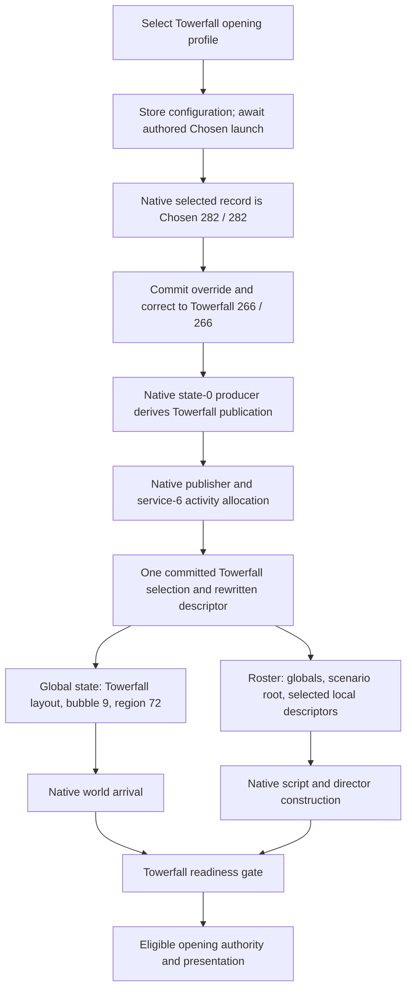

# Towerfall loading, mission tables, and the Chosen bootstrap

Implementation/history guide for **Homecoming / `mission_towerfall`**, checked against the local source on **6 September 2026**.

The main fix was to let Chosen provide a valid native launch opportunity, then correct the selection **before Destiny derived and published the mission contract**. Renaming the package after that point left other fields associated with the donor activity. The current focused bootstrap changes the selected source and destination to Towerfall, runs Destiny's own publication builder, and carries that corrected selection through the server's activity allocation and world-state messages.

Getting Towerfall's mission tables working was a second part of the job: the server had to publish the installed scenario's actual bubble layout, global registries, scenario root, and selected area's local descriptors. Loading the geometry did not automatically initialize those mission systems.

## 1. The identities we had to keep consistent

The relevant identifiers are:

- **Chosen:** activity index **282** (`0x11A`), the selectable native launch donor.
- **Homecoming:** activity index **266** (`0x10A`), package **`mission_towerfall`**.
- **Towerfall investment hash:** `62D85FB3`.
- **Package-definition hash:** `9ACCB518`.
- **Activity asset:** `80B500AC`.
- **Launch descriptor asset:** `80FDB97F`.
- **Measured opening:** bubble **9**, Underwatch, bubble hash `81EB50AE`, packed region/slice set **72**, state **0**.

The region encoding uses a factor of eight: this opening is `9 * 8 + 0 = 72`. A bubble ordinal, a packed region, an investment activity index, and an asset hash are different identifiers. Interchanging them can produce a plausible-looking configuration that still selects the wrong content.

The profile leaves its spawn-set choice unset. It uses the authored arrival handling instead of forcing the generic spawn set `2EA8FB98` into an area that might not contain that set's points.

Source: [Towerfall profile](<C:/Destiny 2 Development/Sunrise/src/state/activity/forced/definition.h:58>), [native activity identities](<C:/Destiny 2 Development/Sunrise/src/client/hooks/bootflow/towerfall_executor_bootstrap.cpp:37>), [slice encoding](<C:/Destiny 2 Development/Sunrise/src/middleware/content/packages/tables/scenario_reader.h:37>).

## 2. Why Chosen could still determine the result

Destiny does not choose a mission from one package-name string. The launch path carries a source activity, destination activity, package name, native publication state, and additional authored descriptor fields. Native consumers use those inputs to resolve the activity definition, activity type, destination, and matchmaking identity.

Two separate partial fixes were insufficient:

1. **Changing the visible destination too late.** A record could say `mission_towerfall` while the native publication had already been derived from Chosen's indices. A later consumer could still follow the donor's definition or route.
2. **Reconstructing only the obvious descriptor fields.** The earlier research compared a roughly 372-bit minimal descriptor with a roughly 620-bit authored Chosen descriptor. Copying the name and activity number did not reproduce the authored route context. Replaying a descriptor through activity message 1 also did not populate the separate native route holder used by launch.

The earlier investigation additionally found that clearing the source activity to “absent” broke authored-route selection even when the opaque descriptor bits survived. A Tower social landing descriptor was another unsuitable donor: changing its visible fields still left a social-shaped contract that could start `city_tower_social_d2`.

These findings led to two rules: preserve a real mission-shaped launch contract, and correct its inputs at the point where native code can rebuild the dependent fields.

Historical evidence: [authored-route investigation](<C:/Destiny 2 Development/HOMECOMING-AUTHORED-ROUTE-HANDOFF-20260819.md:254>), [descriptor findings](<C:/Destiny 2 Development/HOMECOMING-FINDINGS.md:105>). Current handling: [forced destination application](<C:/Destiny 2 Development/Sunrise/src/state/activity/forced/activity_forced_destination.cpp:343>).

## 3. Stage the request, then commit at Chosen's native prelaunch boundary

Clicking **Towerfall opening** stores the package, bubble, and slice selection. It does not immediately make Homecoming the operational global override.

`g_homecomingCommitted` remains false until a valid Chosen launch arrives. Consequently, blank or unrelated fallback allocations do not prematurely construct a Towerfall activity while the client is still creating the donor route. The UI reports that the prelaunch is armed and asks the operator to start Chosen.

The focused native hook calls `commit_homecoming_authored_selection()` only for the expected original tuple **282 / 282** and an enabled Towerfall configuration. The commit also clears the prior opening-host-ready latch so an acknowledgement from the previous activity cannot activate the new mission.

There is a server-side commit path too: if a captured authored selection reaches service 6 before the native commit, `apply()` can recognize a descriptor whose source or destination names Chosen and commit there. A blank selection cannot satisfy that condition.

Changing or clearing the profile resets the commit/readiness latches. The profile is process-local and is not saved across restarts.

Source: [staging and reset](<C:/Destiny 2 Development/Sunrise/src/state/activity/forced/activity_forced_destination.cpp:152>), [prelaunch commit](<C:/Destiny 2 Development/Sunrise/src/state/activity/forced/activity_forced_destination.cpp:243>), [server-side authored-selection gate](<C:/Destiny 2 Development/Sunrise/src/state/activity/forced/activity_forced_destination.cpp:317>).

## 4. The current fix: rebuild a Towerfall publication from Towerfall inputs

### Correct the selected record before it is copied

The active owner is `towerfall_executor_bootstrap.cpp`. Its selection accessor hook runs the original accessor first, then requires the exact launcher return site and the original Chosen tuple before applying the staged override.

`correct_selection_record()` writes:

- Selected source at `+0x12`: **266**.
- Selected destination at `+0x14`: **266**.
- The 40-byte package field at `+0x60`: **`mission_towerfall`**, with cleared padding.

Both indices change because a direct native mission is self-selected. The code uses Omega's `299 → 299` behavior as the model: giving the native builder `266 → 266` lets it resolve the dependent activity fields from Towerfall itself.

This is a scoped edit of the selected launch record. The hook does not replace every Chosen row in the game's global activity tables. The investment/package/asset constants at the top of the file document the expected Towerfall identity; they are not four extra scalar patches applied by this function.

### Run the native state-0 publication builder

The correction arms a pending publication flag. At the matching native publisher call, the hook consumes that flag and, when the descriptor has a nonzero type and state 0, invokes Destiny's original **state-0 producer**.

That producer derives the full publication from the corrected selection. The hook then calls the original publisher with the resulting descriptor. It records success only when native publication succeeds and the descriptor contains **266 / 266 / `mission_towerfall`**.

This is the important ordering:

```text
Chosen supplies the native launch
    → correct selected source, destination, and package
    → native producer derives the publication
    → native publisher publishes it
    → service 6 receives the corrected selection
```

A successfully published Towerfall route can also be retained as a bounded 0xB0-byte copy, together with its manager identity. The retained-route fallback was built for the later executor retry experiment; it is not exposed as a permanent replacement for ordinary route lookup.

The hook targets are validated against the pinned client. Installation checks function prefixes and locates the state-0 producer through a unique signature, then installs the accessor/publisher hooks together. An unexpected binary layout defers the installation rather than guessing an address.

Source: [selected-record correction](<C:/Destiny 2 Development/Sunrise/src/client/hooks/bootflow/towerfall_executor_bootstrap.cpp:491>), [guarded prelaunch accessor](<C:/Destiny 2 Development/Sunrise/src/client/hooks/bootflow/towerfall_executor_bootstrap.cpp:545>), [native publication](<C:/Destiny 2 Development/Sunrise/src/client/hooks/bootflow/towerfall_executor_bootstrap.cpp:607>), [hook installation](<C:/Destiny 2 Development/Sunrise/src/client/hooks/bootflow/towerfall_executor_bootstrap.cpp:703>).

### Why older notes say 282 → 266

The earlier successful loading path preserved Chosen as the authored source and changed the destination to Homecoming: **282 → 266**. That was a meaningful improvement over clearing the source or fabricating a minimal descriptor.

The current focused prelaunch code goes further: it rewrites both selected indices to **266 → 266** before native derivation. The server's descriptor-preservation path still supports an authored source of 282, and the diagnostic route matcher accepts either source when the destination and package are Towerfall.

Therefore an old `source=282 destination=266` log is valid historical evidence. For the current focused native correction, the expected selection-contract log shows both indices becoming 266. These describe successive implementation stages, not one interchangeable tuple.

## 5. Keep the corrected contract consistent on the server

Service 6's `prepare_allocation()` copies the incoming selection scalars **and the captured descriptor bits** into one `DestinationSelection`. It applies arrival defaults first, then applies the committed forced destination before preparing the activity session.

This avoids having global state, membership, or roster publication independently guess what the operator intended.

For Towerfall, the final selection sets activity 266 and package `mission_towerfall`, removes stale element/arrival choices, and carries bubble 9 and region 72 overrides. An unset spawn choice is represented by the canonical absent hash `811C9DC5`.

`rewrite_descriptor()` updates the captured wire representation as well as the scalar fields. Its prefix contains a four-bit reason, twelve-bit source, and twelve-bit destination, all with bias 1. The 40-byte package field uses bias 128. The remaining usable authored bits are retained.

That second rewrite matters because the global-state publisher can replay the captured descriptor verbatim. Updating only `selection.packageName` while leaving a captured Chosen name or destination inside `descriptorBits` would send contradictory versions of the same selection.

If a usable captured name cannot be rewritten, or the source is the known unsuitable Tower social descriptor, the implementation clears the captured form and uses the reconstructed fallback. That fallback is not equivalent evidence of a complete authored mission route.

Source: [service-6 allocation](<C:/Destiny 2 Development/Sunrise/src/server/bap/encrypted/activity_host_manager/activity_host_manager_route.cpp:118>), [packed descriptor rewrite](<C:/Destiny 2 Development/Sunrise/src/state/activity/forced/activity_forced_destination.cpp:115>), [global-state use of the committed selection](<C:/Destiny 2 Development/Sunrise/src/server/bap/encrypted/push/activity/activity_global_state_push.cpp:49>).

## 6. How the load and mission tables were reconstructed

There are three related structures here:

- **Native activity/launch data:** the client's definition and route machinery, selected by the corrected activity indices and native producer.
- **Extracted scenario layout:** the package's bubbles, states, package membership, and registry references, used to build host world-state messages.
- **Mission roster/descriptors:** the actual script, director, dialogue, directive, Scene, and other objects that the host must register and seed.

Correcting the first structure stopped Chosen from remaining the source of the derived launch fields. Reconstructing the other two gave the loaded Towerfall world its mission objects.

### Read Towerfall's scenario rather than reuse a generic layout

The scenario extraction walks the installed scenario's bubbles and slice-state entries into their registries and placed objects. `Definition` retains the bubble hashes, state counts, map-global indices, loaded packages, and roster-group references.

Global activity state looks up that layout by the **committed package name**. It takes both `bubbleCount` and the bubble-state array from the same extracted layout and resolves the selected arrival against it. Mixing a count from one activity with states from another would still produce bytes, but not the correct world selection.

Source: [scenario data model](<C:/Destiny 2 Development/Sunrise/src/state/build_data/scenarios/definition.h>), [scenario/registry walk](<C:/Destiny 2 Development/Sunrise/src/client/content/scenarios/scenario_roster_build.cpp:209>), [global-state layout selection](<C:/Destiny 2 Development/Sunrise/src/server/bap/encrypted/push/activity/activity_global_state_push.cpp:73>).

### Include the scenario root and selected area's local registries

The ordinary roster keeps globally safe groups and bubble-local groups with their masks. Global safety uses intersection across the readable slice sets; a group reachable in only one area cannot be treated as globally available. Publishing an unavailable group can break native lookup or teardown.

Towerfall also needed authored groups beyond that ordinary roster. The extraction records a **scenario root** from the primary registry and **selected-slice locals** from the third registry, with same-package and explicit `ObjectBubble` evidence. These are stored as per-slice authored overlays.

`fill_roster()` combines:

1. Ordinary top-level groups.
2. The additional authored scenario root, when not already covered.
3. Ordinary bubble-local groups.
4. The additional local authored groups for the selected area.

The root contributes to the top-level count; local groups belong in the selected bubble sub-block. Duplicate registry identities, conflicting layouts, unresolved extraction, and capacity failures prevent an invalid overlay from being published. In the current builder, authored overlay selection is restricted to aligned base-state regions; region 72 selects ordinal 9.

This is why loading the Towerfall map alone was insufficient: the mission's root and local object registrations also had to exist.

Source: [global roster intersection](<C:/Destiny 2 Development/Sunrise/src/middleware/content/packages/tables/roster_intersection.cpp>), [authored-overlay validation](<C:/Destiny 2 Development/Sunrise/src/client/content/scenarios/scenario_roster_publish.cpp:171>), [wire roster assembly](<C:/Destiny 2 Development/Sunrise/src/server/bap/encrypted/push/activity/activity_roster_snapshot.cpp:191>).

### Preserve descriptor identities and schemas

The slot extractor follows placed-object and indirect descriptor references. For each client-backed slot it records the registry key, actual type/index, descriptor tag/offset, component class, sense schema, and authority schema.

The actual slot index is preserved even when host-only entries have no client descriptor and are omitted. Array ordinal is therefore not a substitute for slot identity. Authority/sense flags come from the descriptor's available schemas.

For the Tower Watch opening, useful identities include mission runtime **`4786C0E0`**, root cue registry **`664128F4`**, and local registry **`9D8076E4`**. The local directive is **68/0**, dialogue **53/2**, and the recovered breach Scene **43/5**.

The historical capture mapped all **98 observed Towerfall sense objects** to their descriptors. That established usable object identity and decoding; it did not prove that every mission action or successor edge was implemented.

Source: [descriptor reader](<C:/Destiny 2 Development/Sunrise/src/middleware/content/packages/tables/slot_descriptor_reader.h>), [Tower Watch identities](<C:/Destiny 2 Development/Sunrise/src/middleware/bap/activity_message/tower_watch_cue_manifest.h>), [captured-snapshot parser test](<C:/Destiny 2 Development/Sunrise/unit/activity_sense_update_parser_tests.cpp:340>).

## 7. Bootstrapping mission execution after the load

The authored-runtime investigation found another ordering issue: a local manager could already exist before the authored destination arrived. Forcing manager modes, selected slots, or lifecycle flags produced resets or misleading intermediate states. Those experiments are separate from the durable prelaunch correction.

The historical bootstrap used the native route → launch producer → authored manager → component dispatch chain, and explored binding the live activity-host descriptor to script identity 1. The August 27 handoff records successful manager registration, opening objective, and first Ghost line on that build.

The current code has an explicit, narrow Towerfall readiness gate. It requires:

- The native spawn predicate allows entry and world phase is `arrived`.
- Initial-slice completion is observed.
- Native world state is readable and equals 3.
- Local player readiness is true.
- Native type-18 script and type-35 director runtimes exist.

Those witnesses allow Towerfall to replace an unreachable archived migration-alias acknowledgement with `mark_towerfall_native_ready()`. Merely listing script/director objects in a packet does not satisfy it.

**Current configuration distinction:** `kTowerfallIdentityMutationEnabled = false`. The arm function returns with `identity_mutation=disabled producer_retry=disabled`, and the manager-update hook does not invoke the identity-binding/retry helpers. The prelaunch record correction and native publication builder remain a separate enabled path. The broad historical `activity_selection_probe.cpp` is also quarantined by the current hook lifecycle.

Thus the file's name and its retained experimental functions should not be read as evidence that all those mutations run today.

Source: [native readiness predicate](<C:/Destiny 2 Development/Sunrise/src/client/hooks/bootflow/spawn_hold_policy.h:47>), [readiness observation](<C:/Destiny 2 Development/Sunrise/src/client/hooks/bootflow/spawn_hold.cpp:381>), [disabled retry arm](<C:/Destiny 2 Development/Sunrise/src/client/hooks/bootflow/towerfall_executor_bootstrap.cpp:2177>), [legacy-hook isolation](<C:/Destiny 2 Development/Sunrise/src/client/hooks/bootflow/bootflow_hook_lifecycle.cpp:36>).



## 8. How to verify the path and distinguish failures

For the current focused launch, look for these checkpoints in order:

1. `activity_profile ... result=staged ... commit=awaiting_chosen_activity_282`.
2. `towerfall_direct stage=install ... result=ok` for the validated prelaunch hooks.
3. `activity_override ... trigger=authored_chosen_prelaunch_282`.
4. `towerfall_direct stage=selection_contract result=corrected`, with source and destination changing from 282 to 266.
5. `towerfall_direct stage=prelaunch_publication result=accepted`, with source 266, destination 266, package `mission_towerfall`, and `native_publish=1`.
6. Service 6's committed Towerfall selection, followed by `change-world: loaded mission_towerfall` and the intended opening region.
7. Correct roster/sense decoding and the native world/script/director readiness witnesses.

If Chosen's content still wins, inspect the selected record and derived publication before changing the roster. If the Towerfall map loads but mission objects are absent, inspect the selected layout, authored overlays, descriptor flags, and native seeding. If the objective and dialogue appear but the breach does not, the launch has already passed; the remaining fault is further into mission execution.

The safe historical handoff explicitly left wall breach, the first Cabal wave, and full mission progression incomplete. The current manifest still disables unsafe breach Scene publication with `kPublishBreachSceneAuthority = false`, because its recovered active reference lacks a valid native runtime binding. The [cue-edge export](<C:/Destiny 2 Development/Sunrise/exports/towerfall_cue_edges.md>) also reports zero recovered explicit successor edges. Reconstructing a mission table is not the same as reconstructing the complete host mission script.

This guide documents the current source and the recorded development results; it does not claim a new live test. Supporting references are the [August 27 safe handoff](<C:/Destiny 2 Development/HANDOFF-HOMECOMING-TOWERFALL-SAFE-TRACE-2026-08-27.md>), [full dialogue/mission-graph guide](<C:/Destiny 2 Development/GHOST-DIALOGUE-MISSION-GRAPHS-SCOT-TOWERFALL.md>), and [current archive integration notes](<C:/Destiny 2 Development/Sunrise/OMEGA-SRC-PORT.md>).
